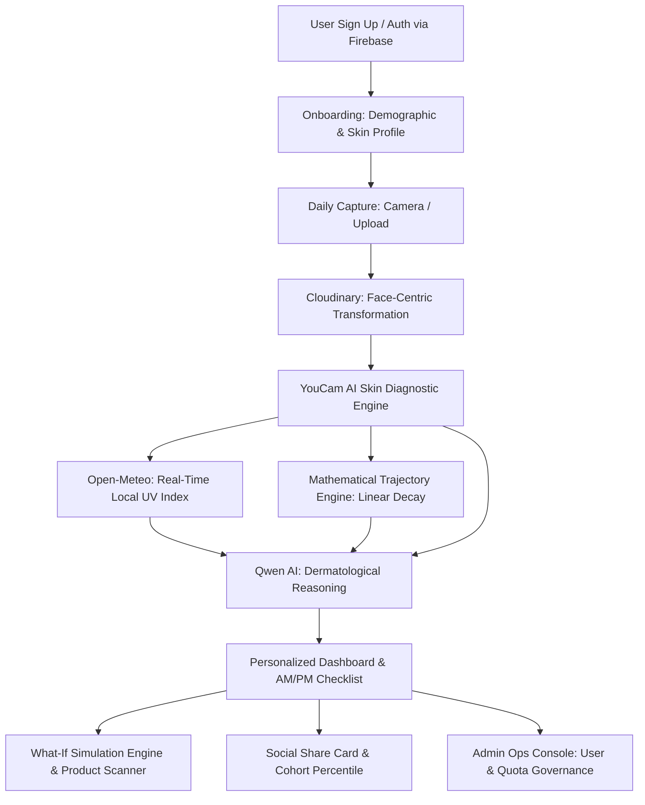

# TintKin: Executive SaaS Product & Architecture Overview

**TintKin** is an AI-powered **Skin Longevity and Personalized Wellness Journal** operating at the intersection of **BeautyTech, Computer Vision, and Preventive HealthTech**. 

Rather than relying on generic beauty questionnaires or unverified consumer claims, TintKin provides an **objective, quantified, and visually verifiable skincare tracking platform**. It bridges clinical dermatological diagnostics with daily consumer routines—empowering users to measure their skin health, simulate future aging trajectories under different regimens, and stick to evidence-based skincare habits.

---

## 1. What TintKin Does (The SaaS Value Proposition)

### The Market Problem
The global skincare market exceeds **$180 Billion**, yet consumer frustration is at an all-time high:
1. **Skincare Fatigue & Trial-and-Error:** Consumers waste hundreds of dollars each year on products without knowing if they actually work for their unique skin biology.
2. **Delayed Feedback Loops:** Skin renewal cycles take **28 to 45 days**. Consumers abandon effective routines prematurely or persist with irritating products because visual changes are imperceptible day-to-day.
3. **No "Try-Before-You-Buy" for Longevity:** Consumers cannot visualize the long-term impact of adopting an active serum, daily SPF, or better sleep before committing.

### The TintKin Solution
TintKin transforms the smartphone into a **clinical-grade skin diagnostic companion**:
- **Objective Multi-Biomarker Analysis:** Evaluates 4 key skin health pillars (Wrinkles, Firmness, Spots/Hyperpigmentation, and Radiance) plus biological Skin Age from a single daily photo.
- **Predictive "What-If" Simulations:** Combines biophysical decay models with generative facial image simulation to show users side-by-side visual projections of their skin 1, 5, or 10 years into the future.
- **Context-Aware Dynamic Regimens:** Synthesizes the user's biomarker scores, biological profile, and real-time environmental factors (local UV index) to prescribe structured AM/PM routines and targeted facial exercises.
- **Clinically Grounded Habit Adherence:** Enforces dermatologically sound 30-day routine locks (preventing product-hopping), paired with gamified streaks and peer cohort benchmarking.

---

## 2. Core SaaS Workflows & User Journeys

---

### Workflow 1: Onboarding & Clinical Baseline Calibration
1. **Authentication:** The user registers or signs in via Firebase Authentication (Email/Password or OAuth).
2. **Clinical Baseline Survey:** The user completes a structured intake:
   - Date of birth (calculates biological age).
   - Biological sex & self-reported Fitzpatrick/skin type (`oily`, `dry`, `combination`, `normal`, `sensitive`).
   - Primary skin wellness goals (e.g., barrier repair, anti-aging, hyperpigmentation control).
3. **Privacy Preference Selection:** The user configures their data retention model—opting between storing secure analysis photos or enforcing **Zero-Knowledge Photo Deletion** (where photos are purged from cloud storage immediately after AI feature extraction).

---

### Workflow 2: Daily Scan & Clinical Diagnostic Pipeline
1. **Intelligent Capture:** The user opens the camera interface with native front/back switching, mirror flip controls, and live posture guides.
2. **Quota Verification:** The system checks tier eligibility (`canScanToday`, monthly allowances, and pacing intervals like every-other-day strict mode).
3. **Automated Face Framing:** The image is uploaded to Cloudinary using signed HMAC credentials. Cloudinary injects a face-detection thumbnail transform (`c_thumb,g_face,z_1.3,w_1200,h_1200`), auto-centering the facial features into YouCam’s optimal 60–80% face-width zone.
4. **Clinical Computer Vision (YouCam AI Engine):**
   - Dispatches an asynchronous skin-analysis task targeting wrinkles, firmness, age spots, and radiance.
   - The engine polls task status with automatic exponential backoff.
   - Extracts scores from inline JSON or unzips clinical diagnostic payloads (`score_info.json`) in-memory via `fflate`.
5. **Storage & Auto-Purge:** If the user configured strict privacy, the source photo is immediately deleted via Cloudinary's Admin API; if not, previous daily selfies are rotated out to minimize cloud storage overhead while maintaining clinical trend data.

---

### Workflow 3: Multi-Modal Regimen Generation (AI Dermatologist Copilot)
1. **Context Synthesis:**
   - User profile (age, skin type, primary goals).
   - Objective scores (wrinkles, firmness, spots, radiance, overall skin harmony).
   - **Environmental Intelligence:** Real-time maximum UV index fetched dynamically via Open-Meteo using the user’s geocoded latitude/longitude.
2. **LLM Dermatological Reasoning:**
   - `qwen-plus` processes the combined diagnostic and environmental payload.
   - Generates behavioral, non-prescriptive recommendations (e.g., UV-adjusted sunscreen advice, barrier-repair cues).
   - Formulates a custom 3-product stack (Cleanser, targeted treatment Serum/Exfoliant, and barrier Moisturizer/Sunscreen) with actionable AM/PM routines and a targeted facial lymphatic workout.
3. **Clinical 30-Day Lock Safeguard:**
   - Dermatological principle: skin cell turnover requires ~4 weeks. Constant switching causes barrier damage.
   - TintKin locks product and habit recommendations for 30 days and facial workouts for 7 days, providing continuity while updating daily diagnostic telemetry.

---

### Workflow 4: "What-If" Longevity Simulation & Vision Product Scanner
1. **Simulation Configuration:** Users can run 3 simulation modes:
   - **Single Intervention:** Routine vs. Baseline (e.g., "What happens if I add daily SPF?").
   - **Head-to-Head:** Product A vs. Product B (e.g., Retinol vs. Vitamin C).
   - **Custom Stack:** Multi-product custom routine vs. untreated baseline.
2. **Physical Product Scanner (Vision AI):**
   - Pro tier users snap a photo of any physical product bottle's ingredient list.
   - `qwen-vl-max` reads the label via multimodal OCR, categorizes the formula, extracts key active ingredients, and computes a scientific **aging deceleration multiplier** ($0.65 - 0.95$).
3. **Mathematical Trajectory Modeling:**
   - Applies linear regression over historical user scans to compute personalized decay velocity.
   - Applies compound multipliers (SPF: $-45\%$ photoaging, Retinol: $-40\%$ wrinkle loss, High UV without SPF: $+50\%$ acceleration, Sleep deprivation: $+35\%$).
4. **Photorealistic Visual Simulation:**
   - Translates predicted score deltas into YouCam Simulation API concern intensities.
   - YouCam renders the altered facial image.
   - The user interacts with a responsive split-screen comparison slider (`ReactCompareSlider`) to see their projected future face.

---

### Workflow 5: Gamification, Streaks & Demographic Cohort Benchmarking
1. **Habit Tracking:** Users check off AM/PM steps in the `RoutineChecklist`. Completing daily steps updates their streak.
2. **Trophy Case:** Unlocks milestone badges (7-Day Streak, 1-Month Consistency, 3-Month Master, 1-Year Dedication).
3. **Anonymous Cohort Percentile Ranking:** Users who opt in are dynamically benchmarked against active peers in their demographic bracket ($\pm 5$ years). The system computes an exact percentile rank:
   $$\text{Percentile} = \left(\frac{\text{Peers with Score} \le \text{User Score}}{\text{Total Demographic Cohort}}\right) \times 100$$
4. **Viral Growth Engine:** The `/share` module leverages `html-to-image` to generate clean, watermarked skin score cards for social sharing on Instagram Stories, TikTok, or WhatsApp.

---

### Workflow 6: Enterprise Ops Console & Administrative Governance
1. **Passwordless Admin Authentication:** Secure OTP login via Resend email with time-limited (5 min) 6-digit codes, attempt rate-limiting, and HMAC-signed HTTP-only session cookies.
2. **Platform Governance Dashboard:**
   - Real-time telemetry: Total Users, Active/Inactive counts, Subscribed users, aggregate scans, and total simulations executed.
   - User Management Table: Real-time search, plan switching (Free, Standard, Pro), and manual allocation of bonus scans (`adminAddExtraScans`) for customer support resolution.

---

## 3. Technology Stack & Architectural Rationale

| Layer | Technology | Architectural Rationale & SaaS Benefit |
| :--- | :--- | :--- |
| **Framework** | **Next.js 16 (App Router)** | Hybrid Server/Client Components, React Server Actions for zero-API-boilerplate data mutations, native streaming, and SEO-optimized static metadata. |
| **Frontend UI** | **React 19 & Tailwind CSS v4** | Modern component architecture, ultra-fast styling with zero-runtime CSS, smooth micro-interactions, responsive mobile-first glassmorphism design. |
| **Data Visualization** | **Recharts & React-Compare-Slider** | Canvas/SVG radar charts for multi-concern profiling, line charts for longitudinal progression, and zero-latency split-screen comparison sliders. |
| **Database & ODM** | **MongoDB Atlas + Mongoose** | Flexible document schema capable of storing structured clinical metrics, nested simulation runs, routine histories, and connection-pooled serverless execution. |
| **Authentication** | **Firebase Auth + Admin SDK** | Enterprise-grade identity handling OAuth, JWT verification on Server Actions, secure token refresh, and cross-platform compatibility. |
| **Clinical Diagnostic AI** | **Perfect Corp YouCam API** | Industry gold standard in cosmetic dermatological analysis; provides verified clinical diagnostic benchmarks and realistic facial aging simulations. |
| **Reasoning & Vision LLM** | **Alibaba Cloud Qwen (`qwen-plus`, `qwen-vl-max`)** | High-throughput structured JSON output for dermatological reasoning; vision model enables OCR and cosmetic ingredient chemistry parsing. |
| **Media Pipeline** | **Cloudinary** | Dynamic face-detection transformations (`g_face`, `c_thumb`), automatic compression, signed uploads, and server-side programmatic asset destruction. |
| **Geospatial & Climate** | **Open-Meteo & BigDataCloud** | Zero-key high-accuracy UV Index forecasts and reverse geocoding to contextualize skin advice against environmental photodamage. |
| **Email Infrastructure** | **Resend** | High-deliverability transactional email API powering passwordless 2FA verification for admin operations. |
| **Data Utilities** | **`fflate` & `html-to-image`** | Microsecond in-memory unzipping of clinical API zip packages without disk writes; client-side canvas generation for shareable assets. |

---

## 4. SaaS Tiering & Monetization Model

TintKin is engineered with a sustainable **Freemium-to-Subscription (PLG)** pricing architecture designed to optimize gross margins against third-party API costs (YouCam & Qwen):

| Tier | Price | Monthly Scans | Monthly Simulations | Core Value Drivers |
| :--- | :--- | :--- | :--- | :--- |
| **Free** | **$0/mo** | 2 scans / mo | 1 simulation / mo | Low-barrier user acquisition, baseline skin score, basic AM/PM routine suggestions. |
| **Standard** | **$12/mo** | 15 scans / mo | 3 simulations / mo | Flexible or **Strict Every-Other-Day pacing** (48h cadence), 12-week longitudinal progress charts, peer benchmarking. |
| **Pro** | **$24/mo** | Daily scans (30–31/mo) | 4 simulations / mo | Daily habit tracking, **Camera Bottle Ingredient Scanner (Vision AI)**, custom longevity multipliers, priority support. |

### Unit Economics & Margin Defense
- **Pacing Safeguards:** The "Strict Every-Other-Day" mode in Standard enforces consistent user pacing, preventing API quota exhaustion in the first week and extending user retention over the billing cycle.
- **Smart Result Caching:** If a user’s facial scores remain unchanged between consecutive scans, advice synthesis results are cached—drastically reducing redundant LLM inference calls.
- **Storage Cost Optimization:** Storing only metadata and rotating or deleting heavy media assets keeps cloud storage costs virtually flat as the user base scales.

---

## 5. Why TintKin is a Winning SaaS Product

### 1. High-Frequency Retention Loops (The Daily Wellness Habit)
Skincare apps often struggle with churn because logging is tedious. TintKin pairs a **5-second selfie scan** with an actionable daily AM/PM checklist and a streak counter, creating a sticky daily habit loop similar to Duolingo or Whoop.

### 2. The "Try-Before-You-Buy" Engine (Affiliate & B2B Monetization)
The **What-If Simulation Engine** has massive commercial potential:
- **Affiliate E-Commerce:** Users can test how adding a Vitamin C serum or SPF will improve their radiance score, with 1-click purchasing links to partnered skincare brands.
- **B2B Brand Integrations:** Cosmetic brands can license TintKin’s simulation technology to prove product efficacy to prospective buyers before checkout.

### 3. Clinically Responsible AI Design
Unlike generic LLM wrappers that output random advice daily, TintKin respects biological realities:
- Enforces **30-day routine locks** to prevent barrier irritation from constant product switching.
- Incorporates real-time **environmental data (UV index)** to ensure recommendations match real-world exposure.
- Maintains strict guardrails: behavioral, non-prescriptive language that protects user safety and limits platform liability.

### 4. Enterprise-Grade Data Privacy
Health and facial data require the highest degree of user trust. TintKin offers full **Zero-Knowledge Image Discarding**—extracting numerical vectors and biomarker scores while permanently purging facial imagery from cloud servers upon request.

---

## Summary
TintKin is not just another tracker—it is an **intelligent longevity copilot for human skin**. By uniting clinical computer vision, multimodal generative AI, dynamic environmental inputs, and rigorous software engineering, TintKin delivers a polished, scalable, and defensible SaaS platform ready for global consumers and enterprise beauty partnerships.
